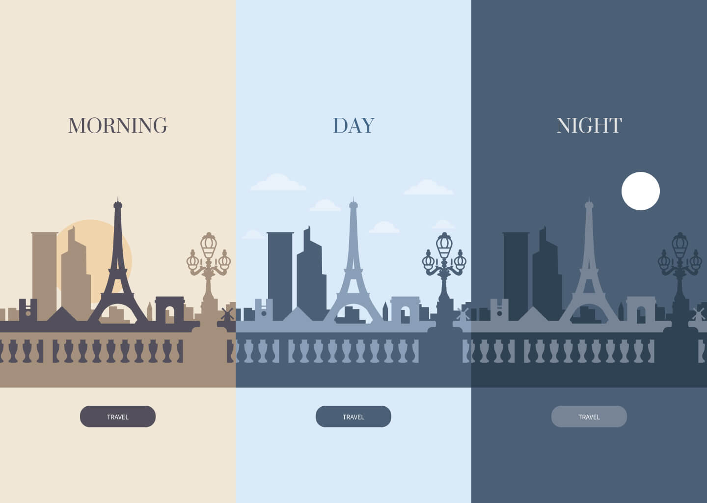

# A day in Paris

*Little animated scene with animated SVG.*



## Installation
Run this command in the terminal to install dependencies :
```
yarn
```

Compile the code
```
yarn dev
```

Compile the code with a local server
```
yarn watch
```

Compile the code for prod
```
yarn prod
```

## Follow me

Accounts : [Twitter](https://twitter.com/anthonylpdev), [Github](https://github.com/anthonylpdev)

## Credits
SVG assets : [Freepik](https://fr.freepik.com/)

## License
[MIT](LICENSE)
